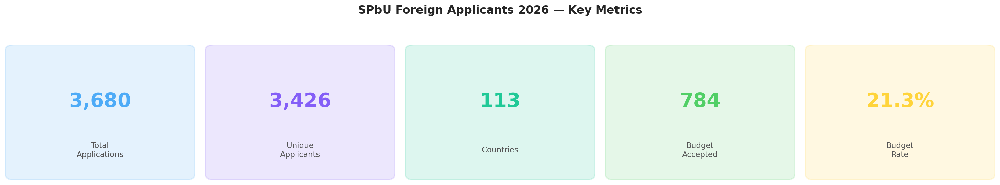
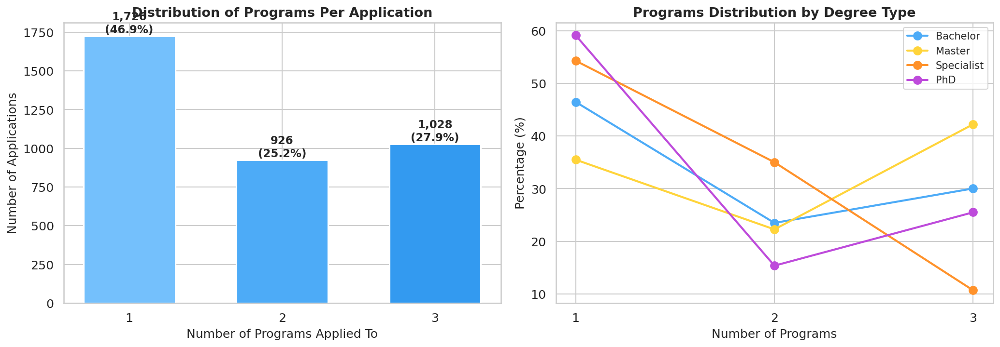
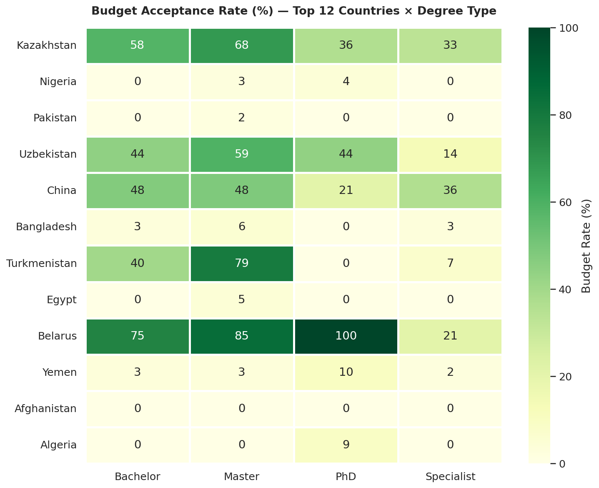
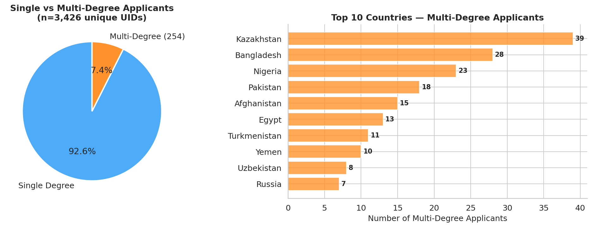
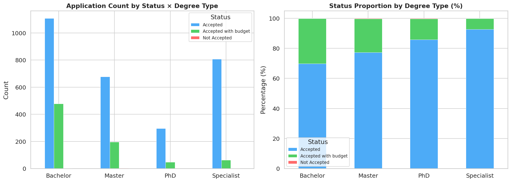
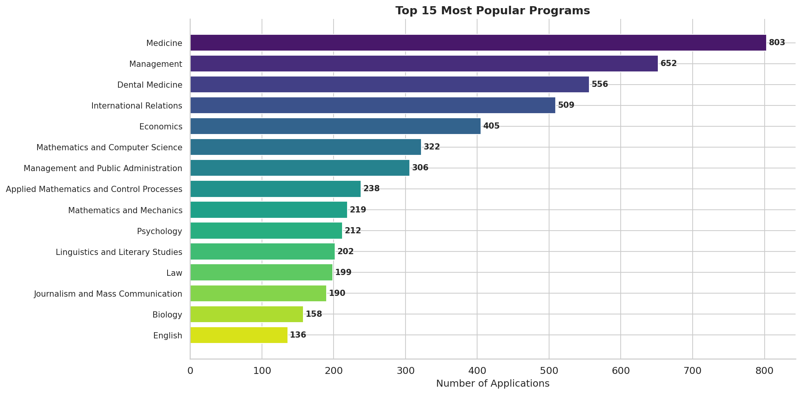
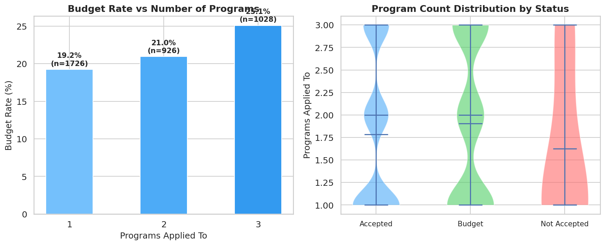
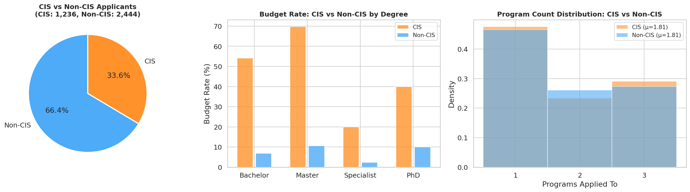

# 🎓 SPbU Foreign Applicants 2026 — Dataset & Analysis
Dataset on Huggingface[https://huggingface.co/datasets/muumaaz/spbu-applicants-2026]
**Saint Petersburg State University (СПбГУ)** — International applicant data for the 2026 academic year.

| Metric | Value |
|--------|-------|
| **Total application rows** | 3,680 |
| **Unique applicants** | 3,426 |
| **Countries represented** | 113 |
| **Budget-funded placements** | 784 (21.3%) |
| **Degree types** | Bachelor, Master, Specialist, PhD |

---

## 📁 Repository Contents

| File | Description |
|------|-------------|
| `spbu_applicants_2026.csv` | Main dataset (6 columns, 3,680 rows) |
| `scrape_spbu.py` | Scraper script that generated the CSV |
| `analysis.ipynb` | Complete Jupyter notebook with analysis, visualizations, and statistical tests |
| `images/` | All 17 visualization PNGs (150 DPI) |

---

## 📊 Dataset Schema

| Column | Type | Description |
|--------|------|-------------|
| `UID` | int64 | Unique applicant registration number (format: 26XXXXXX) |
| `Country` | string | Country of citizenship (Russian, with trailing ` /`) |
| `Programs_Applied_To` | string | Semicolon-separated list of programs |
| `Count_of_Programs` | int64 | Number of programs applied to (1–3) |
| `Status` | string | `Accepted`, `Accepted with budget`, or `Not Accepted` |
| `Applicant` | string | Degree type: `Bachelor`, `Master`, `Specialist`, or `PhD` |

**Note:** 254 UIDs appear twice (applying to both Bachelor AND Specialist programs), bringing the total to 3,680 rows from 3,426 unique individuals.

---

## 🔍 Data Quality Report

### Missing Values
**Zero missing values** across all 6 columns and all 3,680 rows. No blank strings, no NaN values. The scraper creates a row only when all fields are successfully extracted.

### Outlier Analysis
`Count_of_Programs` is the only numeric variable. It is **system-bounded to [1, 3]** by the SPbU application portal:

| Programs | Count | Percentage |
|----------|-------|------------|
| 1 | 1,726 | 46.9% |
| 2 | 926 | 25.2% |
| 3 | 1,028 | 27.9% |

- **IQR method**: Q1=1, Q3=3, IQR=2 → fences at [-2, 6] → **0 outliers**
- **Z-score method**: Max |z| = 1.41 → **0 outliers** (threshold: 3)
- **Rationale**: No outlier removal needed — all values are valid, system-enforced bounds

### Consistency
- ✅ All multi-row UIDs have identical Country values
- ✅ All multi-row UIDs have identical Status values
- ✅ `Count_of_Programs` matches actual semicolon count in 100% of rows

### Data Cleaning Applied
| Step | Rationale |
|------|-----------|
| Country name normalization | Stripped trailing ` /`, normalized `КИТАЙ` → `Китай`, expanded abbreviations (`ИРАН, ИСЛАМСКАЯ РЕСПУБЛИКА` → `Иран`) |
| English translations | Added for visualization readability |
| Region mapping | Grouped 113 countries into 14 world regions for macro-level analysis |
| Program language extraction | Parsed `(in English)` / `(in Russian)` from program names |
| CIS flag | Identified former Soviet states for comparative analysis |

---

## 📈 Key Visualizations

### Overview Dashboard

### Status Distribution

**Interpretation:** 78.5% of applications are accepted (self-funded), 21.3% receive budget (government) funding, and just 0.2% (8 rows) were not accepted. Budget status is determined by olympiad performance — winners with green-highlighted rows in official PDF results receive government funding.

### Applicant Type Distribution

**Interpretation:** Bachelor's programs dominate (43.2%), followed by Master's and Specialist at near-parity (~24% each). PhD applications constitute 9.4%. The Bachelor dominance reflects SPbU's strong undergraduate recruitment pipeline from CIS countries.

### Top 20 Countries (Histogram)

**Interpretation:** Kazakhstan leads with 588 applications (16%). The top 5 countries (Kazakhstan, Nigeria, Pakistan, Uzbekistan, China) account for 48.4% of all applications. The diversity spans Central Asia, Sub-Saharan Africa, South Asia, and the Middle East.

### Country × Applicant Type Breakdown

**Interpretation:** CIS countries skew heavily toward Bachelor programs. South Asian countries (Pakistan, Bangladesh) show more Master/PhD interest. Iran is almost exclusively Specialist (medical degrees).

### Budget Acceptance Rate by Country

**Interpretation:** Budget rates range from 71.4% (Kyrgyzstan) to near 0% for most non-CIS countries. The red dashed line marks the 21.3% overall rate. All countries above this line are CIS member states — reflecting Russia's bilateral education funding agreements.

### Budget Rate by Degree Type

**Interpretation:** Bachelor programs have the highest budget rate (28.6%), nearly double Master's (16.4%). Specialist programs are lowest (11.5%). Budget scholarships for international students are disproportionately allocated at the undergraduate level.

### Programs Distribution

**Interpretation:** PhD applicants are highly focused (74.8% apply to just 1 program), while Bachelor applicants are exploratory (mean 2.06 programs). This reflects increasing specialization at higher degree levels.

### Regional Analysis

**Interpretation:** Central Asia dominates both volume (28.7%) and budget rate (~48%). Western Europe has almost no representation (8 applications total). SPbU primarily attracts applicants from developing countries and former Soviet states.

### Budget Heatmap: Country × Degree Type

**Interpretation:** Kazakhstan shows high budget rates across Bachelor (50%) and Master (45%) but lower for Specialist (13%). Most non-CIS countries show 0% budget rate across all degree types, highlighting the sharp CIS advantage.

### Program Language Preference

**Interpretation:** 58.3% of applications target Russian-medium programs. CIS applicants overwhelmingly choose Russian; English programs attract the most diverse international cohort.

### Multi-Degree Applicants

**Interpretation:** 254 applicants (7.4%) apply to multiple degree types — 253 of these are Bachelor + Specialist combinations. This is a rational hedging strategy between 4-year and 5-year programs.

### Status × Applicant Type

### Top Programs

**Interpretation:** Management (in English) is the most popular program (434 applications), followed by Medicine (in Russian) and International Relations. Medical programs collectively dominate the Specialist category.

### Programs Count vs Budget

### Geographic Concentration (Lorenz Curve)

**Interpretation:** Gini coefficient of 0.799 indicates extreme concentration. The bottom 50% of countries contribute <5% of applications. International student mobility is dominated by a few high-volume corridors.

### CIS vs Non-CIS Comparison

**Interpretation:** The CIS vs Non-CIS divide is the dataset's defining characteristic. CIS applicants have a 49.4% budget rate vs 7.1% for non-CIS — an odds ratio of 12.7×.

---

## 📊 Statistical Analysis Summary

All tests use α = 0.05 significance level.

| # | Test | Variables | Result | Effect Size | Interpretation |
|---|------|-----------|--------|-------------|----------------|
| 1 | **Chi-squared** | Status × Applicant Type | χ²=190.74, p<10⁻³⁸ | Cramér's V=0.161 | Budget rates differ significantly across degree types |
| 2 | **Chi-squared** | Budget × CIS | χ²=870.78, p<10⁻¹⁹¹ | OR=12.71 | CIS applicants are 12.7× more likely to get budget funding |
| 3 | **Kruskal-Wallis** | Programs Count × Degree Type | H=153.77, p<10⁻³³ | — | PhD applicants apply to fewer programs than Bachelor |
| 4 | **Mann-Whitney U** | Programs Count: Budget vs Not | U=1,220,682, p=0.0005 | Small | Budget applicants apply to slightly more programs |
| 5 | **Chi-squared** | Language × Budget | χ²=250.04, p<10⁻⁵⁴ | — | Russian-medium has 5.6× higher budget rate than English |
| 6 | **Spearman** | Country Volume vs Budget Rate | ρ=0.416, p=0.0006 | Moderate | High-volume countries tend to have higher budget rates |
| 7 | **Chi-squared** | Region × Budget | χ²=1084.15, p<10⁻²²³ | **V=0.543** | **Region is the strongest predictor of budget status** |
| 8 | **Z-test** | CIS vs Non-CIS Budget Rates | z=29.55, p≈0 | 42.3pp gap | 49.4% vs 7.1% — the single largest effect |

### Key Statistical Findings

1. **Region is the strongest predictor** of budget status (Cramér's V = 0.543 — a large effect). All other variables are partially or fully confounded by regional patterns.

2. **CIS membership explains most of the variance** in budget acceptance. The 12.7× odds ratio and 42.3 percentage-point gap dwarf all other effects.

3. **Language preference is confounded** — the Russian-medium budget advantage (29.6% vs 5.3%) disappears when controlling for CIS status, since CIS applicants both prefer Russian AND receive more budget spots.

4. **Program count effects are small** — the statistically significant Mann-Whitney result (p=0.0005) reflects a trivial mean difference (1.91 vs 1.79 programs) that is again confounded by CIS status.

---

## 🔑 Major Conclusions

1. **The CIS corridor dominates**: Russia's bilateral education agreements create a two-tier system where CIS nationals receive budget funding at 7× the rate of other international students.

2. **Geographic concentration is extreme**: Gini = 0.799 — the top 5 countries contribute nearly half of all applications.

3. **Degree-level patterns are consistent**: Budget rates decrease with degree level (Bachelor > Master > Specialist), and program specificity increases (PhD applicants are most focused).

4. **SPbU's English programs drive diversity**: English-taught programs (especially Management) attract the most geographically diverse applicant pool.

5. **Iran's unique corridor**: Iranian applicants almost exclusively target dental/medical Specialist programs — a highly focused migration pathway.

---

## 🛠 Data Source & Methodology

Data scraped from three SPbU sources (April 2026):
- **`cabinet.spbu.ru`**: Full applicant lists (UID, GUID), competition groups (UID, Country, Programs)
- **`abiturient.spbu.ru`**: Olympiad result PDFs with green-highlighted budget winners

The scraper (`scrape_spbu.py`) uses `requests` + `BeautifulSoup` for HTML parsing and `PyMuPDF` for PDF analysis. Status is determined by detecting green background fill rectangles (RGB ≈ 0.714, 0.843, 0.659) in the PDF files.

---

## 📜 License

Dataset is derived from publicly available government admissions data published by Saint Petersburg State University.
